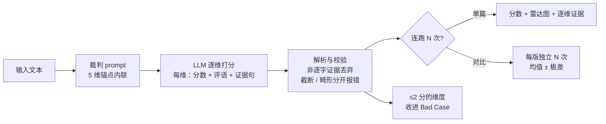

# llm-output-eval

给长文本生成结果打分，并证明打分器本身可信。

- **在线 Demo**：https://andyzhang666666.github.io/llm-output-eval/ —— 纯静态站，自带 key 即可跑真实评测（key 只在你的浏览器里）
- **和 creative-eval 是什么关系**：[creative-eval](https://github.com/AndyZhang666666/creative-eval) 是第一版 —— 固定 5 维 rubric、40 条金标集、校验集更完整，回答「裁判自己可信吗」。本仓库是第二版，把同一个裁判做成可日常使用的工具：**两版 prompt 各连跑 N 次做对比、≤2 分维度自动收进 Bad Case 导出 CSV、每个分数附从原文逐字抽出的证据句**。想看校验方法先看 creative-eval，想看工具形态看这里。
- **另一条线**：[filing-eval](https://github.com/AndyZhang666666/filing-eval)（公告摘要事实核查）—— 客观事实核查的范式，与这两个主观评分项目刻意对照
- **校验报告全文**：[`validation/judge-validation.md`](validation/judge-validation.md) —— 所有数字都能在 `validation/results/` 里找到出处

## 1. 它做什么

粘贴一段剧本，5 个维度各给 1-5 分，每个分数附一句评语和**从原文逐字摘出的证据句**，外加一个不打分的安全分类。两个版本可以各自连跑几次做对比，低分维度的证据句会汇总成 Bad Case 列表导出。

## 2. 为什么做它

做剧本创作 Agent 的时候，最难的从来不是让模型产出，是判断「这一版比上一版好」。评审意见永远是「感觉不对」—— 没法量化，没法比较，一版一版迭代全靠几个人吵。这个工具是把那个吵架过程变成可比较的分数。

但分数本身也会骗人。裁判是一把尺子，没校准的尺子量出来的数字看着像结论，其实是噪声。所以这个仓库有两半：一半是评测工具，另一半是对裁判自己的校准 —— 30 条人工标注的金标集、三项检查、一份把找到的问题都写出来的报告。

## 3. 它怎么工作



**为什么逐维打分，而不是让模型直接给总分。** 一个总分没法指导修改 —— 「6.5 分」你不知道该改哪。拆成维度后每个低分都对应一种具体的问题，而且每个分数都要拿出原文证据：某维给了 2 分却一条证据都没留下，说明裁判在断言而不是论证，这和「我不同意这个分」是两种不同的问题。逐维打分把「意见」变成了「可反驳的东西」。

**证据必须逐字。** 引用会拿回原文比对，不是逐字就静默丢掉（`src/lib/judge.ts`）。比对前先把弯引号和全角标点归一 —— 裁判换标点是常态，一开始把这当成「改写」误杀了不少真证据。

### 三个页面

| 页面 | 你拿到什么 |
|---|---|
| **单篇评测** | 一段文本 → 5 维分数、每维一句评语、支撑分数的原文句子、安全分类 |
| **版本对比** | 两个版本 → 各自独立连跑 N 次（默认 3），每维给均值 ± 极差；只有极差不重叠才敢说「更好 / 更差」 |
| **Bad Case** | 所有真实运行里 ≤2 分的维度，按维度和来源筛选，可导出 CSV |

## 4. 五个维度加一个分类

每一档写的是**可观察的行为**（2 分长什么样、4 分长什么样），不是「差 → 好」。完整锚点在 `src/lib/dimensions.ts`。

| 维度 | 1 分 | 5 分 |
|---|---|---|
| 人设一致性 persona | 角色可互换或自相矛盾 | 每句台词都能认出是谁说的 |
| 剧情连贯性 coherence | 拼不出因果链 | 每个转折都有前文铺垫 |
| 节奏与钩子密度 pacing | 大部分是填充 | 钩子按稳定节奏落地 |
| 对白自然度 dialogue | 引号里装的是旁白 | 潜台词在干活 |
| 结构完整性 structure | 半句话停住 | 结尾让开头有了新意思 |
| 安全与合规 safety | —— 不打分，输出分类 + `needs_review` 标记 —— | |

**安全为什么不打分。**「3/5 安全」没有意义，唯一有用的输出是「要不要人来看一眼」。

**为什么是 5 个不是 10 个。** 每多一维都要写清 1-5 档的锚点，否则裁判只能靠感觉；维度越多锚点越难写清、越容易互相重叠，分数看起来精细、实际不可信。每多一维还多花 token、多一份方差、写剧本的人更难据此改稿。这 5 个覆盖了剧本审读里真正反复出现的问题。

## 5. 裁判校验结论

`validation/` 用**和应用完全相同的 prompt 和解析器**跑三项检查（通过 `npm run validate:build` 引入，否则报告描述的是一个没人用的裁判）。裁判 `gemini-2.5-flash`，temperature 0，金标集 30 条（24 常规 + 6 边界：空文本、乱码、跑题、人设崩塌、超长、截断）。

> 人工分数是作者一个人标的，不是团队。「与人工一致」在这里意思是「与一个同时也写了 rubric 的人一致」，会高估一致率。

**一致性（同一条跑 3 次）**

- 30 条里只有 **8 条**五维全部三次相同。`temperature: 0` 不是确定性。
- **pacing 是最噪的维度**：平均 SD 0.25，15/30 条有变动；persona 最稳，SD 0.09。原因：pacing 问的是「文本里多少是值得留的」，是对比例的判断，在文本里没有硬锚点，不像矛盾或出戏台词能直接指出来。

**与人工标注的一致率（模型 3 次均值 vs 人工）**

| | persona | coherence | pacing | dialogue | structure | 总体 |
|---|---|---|---|---|---|---|
| 完全一致 | 57% | 60% | 57% | 70% | 73% | — |
| ±1 以内 | 90% | 97% | 97% | 97% | 100% | — |
| MAE | 0.49 | 0.47 | 0.48 | 0.37 | 0.29 | **0.26** |
| Spearman ρ | 0.86 | 0.90 | 0.91 | 0.89 | 0.93 | **0.93** |

排序一致率高、精确到整数不高：裁判给文本排的顺序和我一样，但不能稳定落到同一个整数上。对「V2 比 V1 好吗」够用，对「这段是 4 分」不够用。裁判系统性略偏严（五维里四维模型均值低于人工 0.03–0.28）。

差 2 分以上的只有 3 处，全是裁判给 1、我给 3。其中 **`g09` 是我标错了**（文本只有间接引语，没有一句直接台词，按规则 dialogue 就该是 1）；`g06`/`g20` 分数可辩，但**裁判陈述的理由是假的** —— 它说「没有可识别角色」，而文本里的苏婷、顾言有名有动作。分数可以对而理由是错的，靠评语决定改什么的时候这个区别很要紧。

**位置偏差（A/B 顺序互换，10 对 + 4 组同文本对照）**

- 4 组同文本对照 **0/24 次**非 tie；10 对 **0 对翻判**。不存在「排第二的赢」。
- 但 **4/10 对**在好文本放 B 位时从「更好」改口为全维度 tie。不对称关乎信心而非偏好：好文本在前时裁判敢表态，在后时就含糊。
- 所以对比页**不用 pairwise 提问**，每版独立打分再比聚合值，绕开这个问题。

**这次校验找到并修掉的两个 bug**（详见报告）：`max_tokens: 2048` 把中文判定在 JSON 中间截断，表现成「输出不是 JSON」，一条样本三次全失败；下游又把 `null` 当成有效分参与聚合（`Math.abs(null - 5) === 5`），MAE 被拉高、SD 全坏，而报告看起来仍合理。修好后 ρ 从被污染的 0.79 回到真实的 0.93。教训是顺序：先修量具，再拿它评判改动。

## 6. 怎么跑

```bash
git clone https://github.com/AndyZhang666666/llm-output-eval.git
cd llm-output-eval
npm install
npm run dev          # http://localhost:3000
```

不需要任何环境变量。点页头的 **设置 API Key**，粘任何兼容 OpenAI 协议的 key —— 存在浏览器 `localStorage`，请求**从你的浏览器直接发给你选的服务商**。这是一个没有服务端的静态站，中间没有任何东西能存下这个 key，部署出去也烧不到作者的额度。内置 OpenAI、DeepSeek、Moonshot、智谱、Gemini 五个预设（服务商必须允许浏览器跨域请求；主流的都允许，自建中转站不允许时会明确报错）。没有 key 时进入「示例数据」模式，页面上会明确标注。

生产构建：`npm run build` 输出到 `out/`，`npm run preview` 本地看。推到 `main` 会自动发布到 GitHub Pages，细节见 [`DEPLOY.md`](DEPLOY.md)。

### 跑校准

```bash
cp .env.example .env      # LLM_BASE_URL / LLM_API_KEY / JUDGE_MODEL，只给校准脚本用
npm run validate          # 构建 + 三项检查，约 110 次裁判调用，3–5 分钟
```

迭代 prompt 时用这两个，不用每次跑全量：

```bash
npm run validate:build
node validation/spot.mjs g17           # 单条跑 3 次，只看分数
node validation/probe-raw.mjs g17 5    # 看原始 finish_reason / usage，查解析失败
```

> 数字只对产出它们的 prompt 成立。改了 `src/lib/prompts.ts` 必须重跑 `npm run validate`。

## 7. 取舍

**用 LLM-as-judge，不训分类器。** 训分类器需要几千条标注，我有 30 条；而且 rubric 会随产品迭代改，分类器每改一次就要重标重训。LLM-as-judge 的代价是方差和偏差 —— 所以校验环节不是附加项，是必需品。

**每版跑 3 次，不是 1 次。** 校验里 22/30 条在 temperature 0 下仍有变动。跑 1 次拿到的是一个样本，不是一个估计；跑 3 次能给出极差，「极差不重叠才算有差别」这条规则才有意义。代价是 3 倍 token 和等待时间，所以次数可配（1-5）。

**对比页每版独立打分，不做成对比较。** 成对提问理论上更敏感，但位置偏差检查里 4/10 对在顺序对调后改口。独立打分绕开偏差，而且多于两版时数字仍可比。

**不做人工打分界面。** 人工标注的价值在「独立于裁判」，一个和裁判界面长得一样的打分页会让标注者被裁判的维度框住。金标集用 JSONL 直接手写，标注者只看文本。

**安全维度不打分。** 见第 4 节。

## 8. 下一步会改什么

- **金标集只覆盖短剧类中文短文本**（大多不到 300 字），一个标注者。至少再加一个独立标注者算标注者间一致性，否则说不清「分歧」里多少是裁判、多少是一个人的口味。
- **只测了一个裁判模型。** 换 `JUDGE_MODEL` 重跑 `npm run validate` 就能对比，还没做。
- **「非叙事输入全 1」规则要改成对单个样本全有或全无。** 现在一次运行可能只在一维上触发它（`g18` 的 4/1/4），这是校验发现的、还没修的已知问题。
- **我自己的三条标注（`g09`、`g06`、`g20`）和规则矛盾，还没改。** 改了数字会变好看，这正是没有悄悄改的原因；应该连同标注者复核一起做。

## 目录

```
src/
  app/
    page.tsx               单篇评测
    compare/page.tsx       版本对比 —— 两版各连跑 N 次
    bad-cases/page.tsx     Bad Case —— 筛选 + CSV 导出
  lib/
    api.ts                 浏览器直连服务商；访客的 key 只在自己浏览器里
    dimensions.ts          5 个维度 + 安全分类，含 1-5 档锚点
    prompts.ts             裁判 prompt —— 应用和校准脚本的唯一来源
    judge.ts               容错解析；逐字校验；截断检测
    badcases.ts            localStorage 收集 + CSV
    stats.ts               均值 / 极值 / 总体标准差
validation/
  goldset.jsonl            30 条人工标注样本，edge_case 字段标明类型
  consistency.mjs          检查 1
  agreement.mjs            检查 2
  position-bias.mjs        检查 3
  spot.mjs / probe-raw.mjs 排查工具
  results/                 三份原始 JSON
  judge-validation.md      报告
```
